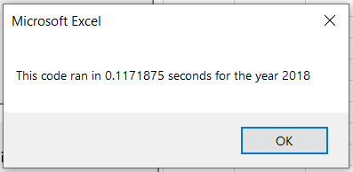

# Stock-Analysis

## Overview of Project
At the request of Steve, I have analyzed the small provided dataset as well as implemented and refactored the macro used for analysis so that it can be run on an expanded dataset in a short amount of time.

### Results
#### Stock Comparison
Looking at the dataset from the year 2017, we can see that most stocks were providing a return by the end of the period, with some going above and beyond. DQ in particular, gaining a return rate of 199.4%, the stock which Steve's parents invested.

However, proceeding onto the next year, 2018 does not look as fruitful for DQ, as well as all stocks provided within the dataset all across the board. DQ itself posses a -62.6% return, a pretty substantial loss when compared to the year before.

Whereas DQ takes a downfall, ENPH managed to maintain its positive return percentage, taking only a minor loss overall from 129.5% to 81.9% gained return. Both of these stocks maintained a similar volume increase as well, both increasing their volume of stocks by almost triple from 2017 to 2018. RUN also maintained a positive return transitioning from 2017 to 2018, from a relatively small 5.5% to 84% postitive returns, at only a volume increase of 187.8% compared to ENPH and DQ with their increased volumes of and 273.9% and 301.3%, respectively.

Keeping these figures in mind, we can determine that both DQ and ENPH are on a downwards trend, with their drops from 2017 to 2018 being a significant drop of -262% for DQ, followed by a -47.6% drop from ENPH. RUN on the other hand managed to have a rise between the given years, with it showing a 78.5% overall increase in returns on its stock.

#### Macro Refactoring
Considering the small dataset, our initial macro was only suited to analyze what was provided within a reasonable amount of time. Both the 2017 and 2018 analysis were completed in under a second.

However, with it running for over half a second with a reduced dataset, applying our current macro to the full dataset of stocks from multiple years, not just 2017 and 2018, we know that in its current state any analysis would take a significant amount of time. Once refactored, our macro was able to proccess the same limited dataset, producing identical results, in less than a fifth of a second, for both years.

Comparing the two sets of proccessing times for our analysis, we find that our refactored script is around 553% faster, on average, than our previous script. This new script should operate significantly better when faced with an expanded dataset.

### Summary
Refactoring script comes with advantages and disadvantages. First and foremost, our script only needing to run through the dataset once increases the speed and efficiency of our script by an immense amount. However, it also requires a few more loops to be created within the script in order to initialize our arrays properly, as well as to display data.
In the case of our VBA script, for a simple few lines of additional code, our proccessing time for our dataset was sped up immensely, which should allow it to handle an expanded dataset in a fraction of the time when compared to our original macro.
